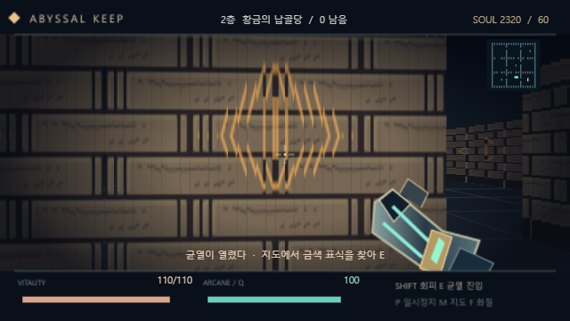

# 심연의 성채 · ABYSSAL KEEP

엔트리 기본 블록으로 실행되는 1인칭 던전 로그라이크. 완성 작품은
[abyssal-keep_007.ent](abyssal-keep_007.ent)입니다. 그림, 효과음,
배경 음악을 파일 안에 포함합니다. 플레이할 때 JavaScript 파일, 확장 프로그램,
외부 서버, 이미지 주소가 필요하지 않습니다.



## 플레이

엔트리에서 `.ent`를 불러오고 **시작하기**를 누르면 타이틀이 나옵니다.
**Enter**로 원정을 시작합니다. 수호자를 처치하고 지도에 금색으로 표시된 균열을
찾아 **E**로 하강하세요. 3층에서 **왕관을 삼킨 자**를 쓰러뜨리면 승리합니다.

| 입력 | 동작 |
|---|---|
| W / S, ↑ / ↓ | 전진 / 후진 |
| A / D | 좌우로 이동 |
| ← / →, J / L | 시점 회전 |
| Space / 마우스 왼쪽 버튼 | 룬 캐스터 발사, 누르면 연사 |
| Shift | 이동 방향으로 회피, 정지 중에는 앞으로 회피 |
| Q | 마력 70을 사용하는 충격파 |
| E | 열린 균열에 들어가기 |
| 1 / 2 / 3, 카드 클릭 | 제시된 유물 선택 |
| P | 일시정지 / 계속 |
| R | 결과 화면 또는 일시정지 중 새 원정 |
| M | 미니맵 표시 전환 |
| N | 음악과 효과음 음소거 전환 |
| F | 표준 60열 → 고화질 80열 → 빠른 40열 |

공격 예고가 뜨면 옆으로 움직이세요. 회피 중에는 짧은 무적 시간이 있습니다.
마력은 서서히 회복하고, 쓰러진 적은 회복약이나 마력 조각을 남깁니다.
유물은 이번 원정 안에서 중첩되며, 사망 후 새 원정을 시작하면 초기화됩니다.

## 완성된 게임 구성

- 서로 다른 분위기의 3개 층: 잊힌 감옥, 황금의 납골당, 왕관의 심장.
- 실행 중 블록으로 생성하는 19×19 던전. 아홉 방, 무작위 통로와 기둥,
  연결된 출구, 층별 초기 배치와 무작위 드롭.
- 근접 수호자, 공격을 예고하는 원거리 망령, 체력이 절반 이하가 되면
  광폭화하여 빈 슬롯에 수호자 두 마리를 소환하는 보스.
- 8종 유물: 피해, 연사, 최대 체력, 방어력, 흡혈, 치명타, 충격파, 이동·회피.
- 조준 보정, 치명타, 총구 섬광, 반동, 명중 표시, 피격 효과, 충격파,
  체력·마력 HUD, 미니맵, 일시정지, 승리·사망 화면.
- 직접 그린 벡터 에셋을 PNG로 포함. 직접 합성한 7개 효과음과 24초 음악.

## 실제 블록으로 구현한 부분

[spec.mjs](spec.mjs)는 엔트리 블록으로 변환하는 제작 소스입니다. 레이캐스팅(2.5D),
벽 뒤 가림, 캐시, 길찾기, 충돌·전투 수식과 재사용 시 주의점은
[심연의 성채 지식 문서](../../knowledge/14-abyssal-keep-case-study.md)에 정리했습니다.

## 검증과 범위

[verification.json](verification.json)은 최종 `.ent`의 SHA-256, 구조 통계,
런타임 검사 목록을 기록합니다. [playthrough.json](playthrough.json)은
**게임 상태를 읽고 키 입력만 보내서** 시작부터 3층 보스까지 완료한 기록입니다.
순간이동, 체력 변경, 함수 직접 호출을 사용하지 않은 플레이입니다.

제작 당시 버전은 생성기 정적 검사와 기존 smoke 테스트 33개, 로컬 기능 검사와 입력 완주가 통과했습니다.
현재 동명 파일은 검사 당시와 해시가 다르므로 기존 결과를 현재 파일의 합격 근거로 그대로 적용하지 않습니다.
검증 당시와 지식 정리 시점의 해시·검사 수·엔진 버전·성능 측정 조건은
[검증한 버전과 범위](../../knowledge/14-abyssal-keep-case-study.md#검증한-버전과-범위)가 정본입니다.
**공식 웹사이트 업로드·실행은 미검증**이며, 온라인 게시나 계정 저장은 수행하지 않았습니다.

## 다시 만들거나 검증하기

`apps/MYentry-game` 디렉터리에서 실행합니다.

```powershell
node games/abyssal-keep/build.mjs
node tools/make-ent.mjs games/abyssal-keep/spec.mjs --check
npm start
```

다른 터미널에서:

```powershell
node games/abyssal-keep/verify.mjs
node games/abyssal-keep/playthrough.mjs
```

`build.mjs`는 소리를 생성하고 기존 파일을 덮어쓰지 않는 다음 번호 `.ent`를 만듭니다.
검증기는 가장 높은 번호를 자동으로 찾습니다. 로컬 편집기는
`http://localhost:3000/editor.html`에서 `.ent` 불러오기 버튼으로 사용합니다.

| 파일 | 용도 |
|---|---|
| [spec.mjs](spec.mjs) | 게임·렌더러·UI의 블록 소스 |
| [assets.mjs](assets.mjs) | 직접 작성한 벡터 그림과 텍스처 조각 |
| [build.mjs](build.mjs) | 효과음·음악 합성, 버전별 빌드 |
| [verify.mjs](verify.mjs) | 통제한 장면의 기능·오류 검증 |
| [playthrough.mjs](playthrough.mjs) | 처음부터 끝까지 키 입력으로 플레이 |
| [harness.mjs](harness.mjs) | 순정 로컬 편집기 테스트 연결 |

## 제작에 참고한 프로젝트 지식

- [블록 DSL과 설계 패턴](../../knowledge/04-script-and-blocks.md)
- [엔진 스케줄링·함수·붓·입력 함정](../../knowledge/07-runtime-quirks.md)
- [엔트리 이미지·사운드 번들링](../../knowledge/03-objects-and-assets.md)
- [3D 정적 사례](../../knowledge/11-3d-game-case-study.md): 직교투영 사례와의 차이를 확인하고,
  이 게임의 원근 DDA·깊이 버퍼는 별도로 구현했습니다.
- [키 입력 플레이 검증](../../knowledge/05-host-editor.md)
