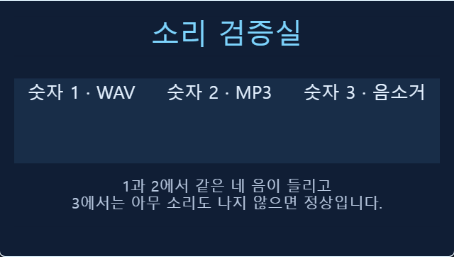

# 소리 검증실

현재 파일: [audio-check_003.ent](audio-check_003.ent).
시작 후 숫자 **1**은 WAV, **2**는 MP3, **3**은 음소거 검사다.
1·2에서는 같은 네 음이 들리고, 3에서는 소리가 나지 않아야 한다. 각 음이 끝나면 다음 키를 누른다.

모든 재생은 실제 엔트리 소리 블록으로 동작한다. `generate-audio.mjs`는 제작 때만 사용하는
자체 음원 합성기이며, MP3 재생성에 ffmpeg가 필요하다. 외부 작품의 음원을 사용하지 않았다.
`_001`은 수정 전후 비교용, `_002`는 안내 화면 중간본, `_003`은 정렬까지 확인한 현재 배포본이다.

로컬 서버 실행 후 `node games/audio-check/verify.mjs`로 검증한다.
[로컬 결과](verification.json)는 2026-09-17 새 사본에서 재측정했다.
[공식 오프라인 결과](verification-offline.json)는 2026-09-11의 역사 기록이며 이번에 재실행하지 않았다.
2026-09-11 사용자 웹 테스트에서는 2번 MP3만 재생됐으며 1번 WAV는 무음이었다.
에이전트의 웹 요청 경로 검증은 미완료다. 이 파일은 형식 비교를 위해 그대로 유지한다.
진단 원리·설치 복구·회귀 검사·웹 검증 범위는 [소리 검증 정본](../../knowledge/15-audio-verification.md)에 있다.
