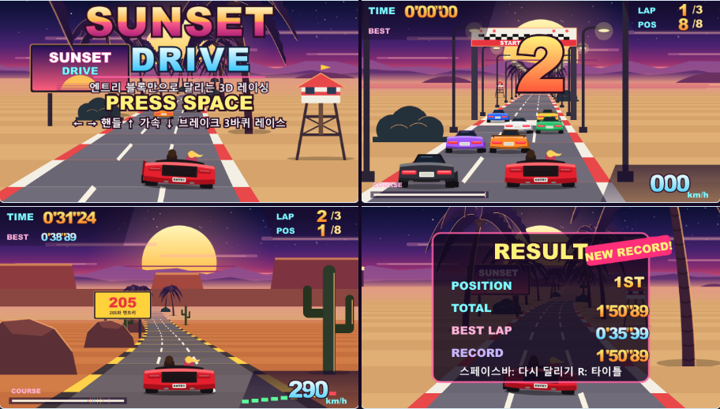

# 선셋 드라이브 · SUNSET DRIVE

엔트리 기본 블록만으로 달리는 아웃런(OutRun) 스타일 유사 3D 레이싱 게임.
완성 작품은 [sunset-drive_002.ent](sunset-drive_002.ent)입니다. 그림·음악·효과음을
모두 파일 안에 포함하며, 실행에 JavaScript 파일·확장 프로그램·외부 서버·이미지 주소가
필요하지 않습니다.



## 플레이

엔트리에서 `.ent`를 불러오고 **시작하기**를 누르면 차가 스스로 달리는 타이틀 화면이 나옵니다.
**스페이스바**로 레이스를 시작하면 3-2-1 카운트다운 뒤 출발합니다. 8대 중 맨 뒤에서
출발해 **3바퀴**를 가장 빨리 도는 것이 목표입니다.

| 입력 | 동작 |
|---|---|
| ↑ 또는 Z | 가속 |
| ↓ 또는 X | 브레이크 (브레이크등이 켜짐) |
| ← / → | 핸들 |
| 스페이스바 | 타이틀에서 출발, 결과 화면에서 다시 달리기 |
| P | 일시정지 / 계속 |
| R | 타이틀로 |
| M | 소리 끄기 / 켜기 |

- 급커브에서 최고 속도를 유지하면 원심력으로 바깥쪽에 밀려납니다. 급커브(노란 화살표
  표지판이 세 개 나온 뒤) 앞에서는 가속을 잠깐 떼세요.
- 도로 밖(모래·잔디)으로 나가면 속도가 약 36%로 떨어지고, 야자수·바위·표지판에 부딪치면
  거의 멈춥니다. 앞차를 들이받아도 크게 감속합니다.
- 랩을 마칠 때마다 방금 랩 기록이 크게 표시되고, 최고 랩과 전체 기록이 저장됩니다.

## 완성된 게임 구성

- **유사 3D 도로**: 커브·언덕·내리막·블라인드 크레스트, 연석과 차선이 원근에 맞춰 흐르고
  먼 곳은 노을 안개로 흐려집니다. 한 바퀴 834구간(약 36~40초).
- **세 구간 테마**: 야자수 해변 → 소나무 숲 → 붉은 협곡. 땅·연석 색과 배경 원경이 바뀝니다.
- **라이벌 7대**: 차선 변경, 추월, 커브 감속, 추돌 판정, 러버밴딩(너무 앞서면 기다리고
  뒤처지면 따라붙음). 화면 위치에 따라 차의 보이는 각도(3방향)가 바뀝니다.
- **레이스 규칙**: 카운트다운, 랩·순위 실시간 계산, LAP 2 / FINAL LAP / FINISH 배너,
  결과 화면(순위·전체 시간·최고 랩·기록, 신기록 표시), 타이틀 화면의 최고 기록.
- **계기판**: 아케이드 숫자로 찍는 랩 시간·최고 랩·랩·순위·속도(km/h), 회전수 막대,
  모든 차가 점으로 움직이는 코스 지도.
- **연출**: 조향 3프레임 + 브레이크등, 오프로드 흙먼지·연석 진동, 급커브 타이어 연기,
  충돌 시 화면 흔들림, 커브에 따라 흐르는 2단 시차 배경, 흔들리는 타이틀.
- **소리**: 직접 합성한 음악 2곡(타이틀·레이스), 카운트다운 신호음, 결승 팡파르,
  속도에 따라 음높이가 오르는 엔진음(2단 기어), 충돌·랩·타이어 소리. 모두 MP3.
- **느린 컴퓨터 대응**: 프레임이 늦어지면 그리는 거리를 자동으로 줄이고(46 → 최소 26구간),
  여유가 생기면 되돌립니다. 게임 속도는 실제 시간 기준(Δt)이라 프레임이 떨어져도 차가 느려지지 않습니다.

## 블록으로 어떻게 만들었나

[spec.mjs](spec.mjs)가 엔트리 블록으로 변환되는 제작 소스입니다(작품 안에는 블록만 들어 있음).
핵심은 **매 프레임 재귀 함수 하나가 도로 46구간을 가까운 곳부터 투영해 붓 채우기로
사다리꼴을 그리고, 돌아오는 길에 그 구간의 차와 길가 물체를 도장으로 찍는 것**입니다.
돌아오는 순서가 곧 먼 곳 → 가까운 곳이라 겹침 순서가 저절로 맞습니다. 언덕은 지금까지 그린
가장 높은 선보다 낮은 구간을 건너뛰는 방식으로 가립니다.

엔트리 블록마다 실행 비용을 직접 재서 설계했습니다. 예를 들어 전역 변수 쓰기는 숨긴 변수여도
약 5µs로 가장 비싸서, 구간마다 반복되는 계산은 함수 매개변수와 지역 변수로만 합니다.
설계·측정값·재사용 시 주의점은 [선셋 드라이브 지식 문서](../../knowledge/19-sunset-drive-case-study.md)에 정리했습니다.

| 오브젝트 | 하는 일 |
|---|---|
| 월드 · 도로와 차 그리기 | 메인 루프: 시간, 내 차 물리, 라이벌 AI, 랩·순위, 카메라, 도로·차·풍경 그리기 |
| 내 차 / 흙먼지 | 조향·브레이크 모양, 진동, 흙먼지·타이어 연기 |
| 계기판 숫자 / 계기판 글자 | 숫자 도장·회전수 막대·코스 지도 / 고정 글자판 |
| 큰 글자 / 타이틀 / 시작 안내 / 결과판 | 카운트다운·배너, 타이틀 로고, 안내, 결과 화면 |
| 하늘과 해 / 먼 산 / 가까운 풍경 | 노을 하늘, 커브에 따라 흐르는 2단 원경(테마별 3종) |
| 소리 · 음악과 엔진 | 상태별 배경음악, 엔진 음높이, 효과음, 음소거 |

## 검증과 범위

[verification.json](verification.json)에 최종 `.ent`의 SHA-256·구조·검사 목록·측정값을 기록했습니다.
검증은 **키 입력(keydown/keyup)만 보내고 게임 변수는 읽기만** 합니다. 시나리오마다 새 브라우저를 씁니다.

| 시나리오 | 확인한 것 |
|---|---|
| boot (11) | 타이틀·자동 주행 데모, 라이벌 7대 주행, 하늘·아스팔트 픽셀, 62 fps, 구조 |
| controls (16) | 카운트다운 중 정지, 3.6초 뒤 출발, 가속·관성·브레이크, 좌우 조향, 오프로드 감속, 길가 물체 충돌, 일시정지·재개, R로 타이틀 |
| audio (15) | MP3 8개 등록·디코딩, 타이틀·카운트다운·레이스 음악, 엔진 음높이 0.55→1.9 상승, 음악은 원래 음높이 유지, 충돌음, M 음소거(출력 0)·복구 |
| race (17) | 키 입력 봇이 3바퀴 완주 **1위**, 랩 기록 3개와 합계 일치, 최고 랩, 신기록, LAP 2·FINAL LAP 배너, 세 테마 통과, 랩 차임·팡파르·타이어 소리, 결과 화면, 스페이스로 재시작 |
| roundtrip (7) | 편집기로 저장 → 다시 불러오기 후 그림 98·소리 8·블록 3,031·리스트 항목 6,506 보존, 재실행 |

2026-09-23 `_002` 기준 **66/66 통과**, 페이지·콘솔 오류 0. 완주 기록 1'50"90
(랩 38.90 / 36.00 / 36.00초). 레이스 전 구간 초당 프레임 중앙값 62, 가장 낮은 1초 55,
블록 실행 시간 중앙값 7.7ms/틱. 측정 환경은 이 PC의 헤드리스 Chromium과
npm `@entrylabs/entry` 4.0.20 엔진입니다.

- **실제 엔트리 사이트 엔진 대조**: playentry.org 만들기 화면(비로그인, 저장하지 않음)에서
  이 게임이 쓰는 블록 49종의 구현과 실행기·도장·크기·모양·붓·소리·변수 내부 함수 39개를
  로컬 엔진과 비교해 **모두 동일**함을 확인했습니다. 차이는 붓 지우기의 EaselJS `clear()`가
  미사용 필드 하나를 초기화하지 않는 것뿐이며 이 게임의 동작에는 영향이 없습니다.
  두 곳 모두 붓·채우기를 CreateJS(Canvas 2D) 경로로 그립니다.
- **느린 기기 모의(CPU 제한)**: 2배 느린 CPU에서 40~45 fps(그리는 거리 자동 26구간),
  4배 느린 CPU에서는 13~14 fps로 조작은 되지만 끊겨 보입니다.
- **하지 않은 것**: playentry.org에 실제 업로드·저장·공개하지 않았고, 그림·소리가 포함된
  이 파일을 공식 사이트에서 직접 실행하지 않았습니다. 사람 귀로 듣는 음질, 모바일·터치 조작도
  확인하지 않았습니다. 사이트에 올릴 때는 만들기 화면의 **오프라인 작품 불러오기**로 이 `.ent`를
  열어 저장하세요.

## 다시 만들거나 검증하기

`apps/MYentry-game` 디렉터리에서 실행합니다. 소리 합성에는 `ffmpeg`가 필요합니다.

```powershell
node games/sunset-drive/build.mjs
node tools/make-ent.mjs games/sunset-drive/spec.mjs --check
npm start
```

다른 터미널에서:

```powershell
node games/sunset-drive/verify.mjs
```

`build.mjs`는 소리를 합성해 MP3로 바꾸고, 기존 파일을 덮어쓰지 않는 다음 번호 `.ent`를
만듭니다(`--out 경로`로 임시 빌드, `--no-audio`로 기존 MP3 재사용). 검증기는 가장 높은 번호를
자동으로 고르며 `--ent 경로`, `--only boot|controls|audio|race|roundtrip`을 받습니다.

| 파일 | 용도 |
|---|---|
| [spec.mjs](spec.mjs) | 렌더러·물리·AI·레이스 규칙·UI의 블록 소스 |
| [track.mjs](track.mjs) | 코스 설계(커브·언덕·테마·길가 물체) → 리스트 데이터 |
| [assets.mjs](assets.mjs) | 직접 작성한 벡터 그림(차·풍경·계기판·배너) |
| [audio.mjs](audio.mjs) | 음악·엔진·효과음 합성기 |
| [build.mjs](build.mjs) | 소리 합성 → MP3 → 번호별 `.ent` 빌드 |
| [verify.mjs](verify.mjs) | L4 런타임 검증(키 입력만, 시나리오별 새 브라우저) |
| [verification.json](verification.json) | 최신 검증 기록 |
| `spike/` | 성능 측정·렌더러 시제품(작품에 포함되지 않음) |

완성본은 `sunset-drive_002.ent`입니다. 타이어 연기·연석 진동·타이틀 기록 표시를 넣기 전 판(`_001`, 당시 검증 58/58)은
용량 때문에 저장소에 올리지 않았습니다.

## 제작에 참고한 프로젝트 지식

- [블록 DSL과 설계 패턴](../../knowledge/04-script-and-blocks.md)
- [엔진 함정: 60fps 틱, 함수 재귀, 붓·도장 예산](../../knowledge/07-runtime-quirks.md)
- [키 입력 플레이 검증](../../knowledge/05-host-editor.md)
- [소리 재생 검증](../../knowledge/15-audio-verification.md): MP3 기본, 실제 출력 측정
- 심연의 성채(ABYSSAL KEEP) 제작 경험: 재귀로 한 프레임 안에 그리기
