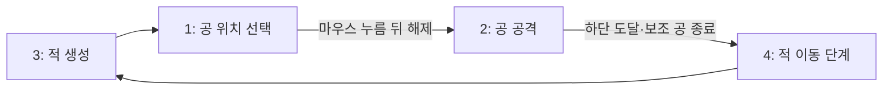

# A Ball 2 사례 — 공 타격 전투·복제 적·스킬 선택

사용자가 제공한 **A Ball 2의 리메이크.ent**를 2026-09-10에 정적으로 분석했다.
마우스로 공의 가로 위치를 정하고 떨어뜨려 적을 타격하며, 웨이브·보스·스킬 선택·강화를
거치는 구조다. 이 문서의 장르 설명은 블록의 입력·상태 전환에서 해석한 것이다.

원본은 수정하거나 저장소에 복사하지 않았다. 작품 속 설명·주석은 분석 데이터로만 취급했다.
[근거 JSON](evidence/a-ball-2-remake.json)은 원본 해시와 주요 블록의 정규화 JSON pointer를 기록한다.
경로의 배열 인덱스는 0부터, 엔트리 리스트 항목 번호는 1부터 시작한다.

- SHA-256: `83a2b07b9e587de58f8db7352caa61fdf3cf2eba2077aafd88f65f2c788c95df`
- 압축 파일 11,722,954 bytes, `temp/project.json` 2,166,033 bytes.
- 확인 범위: 압축·JSON 구조, 블록·상태·에셋 참조, 반사 및 보간 수식의 숫자 교차검증.
- **이번에는 편집기 실행·실제 클릭·보스 완주·FPS를 검증하지 않았다.** 아래 주의점도 재현된 제품 버그와 구분한다.

## 구조와 역할

| 항목 | 정적 집계 |
| --- | ---: |
| 장면 / 오브젝트 / 사용자 함수 / 신호 | 5 / 119 / 14 / 17 |
| 오브젝트 스레드 | 301 |
| 오브젝트 블록 / 함수 블록 / 전체 블록 | 8,385 / 525 / 8,910 |
| 일반 변수 / 리스트 / 타이머 / 대답 | 57 / 27 / 1 / 1 |
| 오브젝트 전용 변수·리스트 선언 | 18 |
| 모양 참조 / 소리 참조 | 245 / 40 |
| tar 이미지 / 썸네일 / 소리 파일 | 482 / 244 / 40 |
| 이미지 확장자 | PNG 244, SVG 238 |

블록 수는 모든 script/content에서 `type` 객체를 재귀 집계한 값으로, 리터럴·함수 헤더·주석·
이벤트에 연결되지 않은 스택도 포함한다. 모양 참조 수와 이미지 파일 수는 서로 다르다.
모양·소리의 `fileurl` 중 `temp/`로 시작하는 참조는 모두 tar 안에 존재했다.
이 사실은 그림의 렌더 품질이나 소리 재생 성공까지 증명하지 않는다.

| 장면 | 오브젝트 수 | 역할 |
| --- | ---: | --- |
| 썸네일(임시) | 10 | 표지 |
| 게임-전투 | 82 | 공·적·보스·효과·보상 UI |
| 게임-맵 | 10 | 다음 스테이지 안내와 전투 데이터 정리 |
| 게임-종료 | 8 | 결과 표시 |
| 메인화면 | 9 | 모드 선택과 게임 시작 |

주요 담당은 `/objects/48` 플레이어(`rwm1`), `/62` 적(`4la4`), `/65` 보스(`ulya`),
`/61` 적 체력 글상자(`9vyi`), `/24` 선택 판(`v9k2`), `/27` 웨이브 관리자(`1h1m`)다.

## 1. 일반 전투는 단계 변수로 맞춘다

**관찰.** `진행 상황/mcix`를 여러 오브젝트가 읽고 쓴다. 작품에 포함된
`진행 상황 표/55w9`의 설명을 실제 대입·대기 블록과 대조하면 일반 전투는 다음 순환이다.



시작 시 `/objects/27/script/1`이 스테이지 설정 함수를 호출하고 첫 생성 수를 4로 정한 뒤,
일반전은 단계 3, 보스전은 단계 13으로 진입한다. 적 관리 루프(`/objects/62/script/0/2`)는
생성 처리를 마치면 1로 바꾸고 4를 기다린 뒤 다음 생성 수와 단계 3을 설정한다.
공은 `/objects/48/script/3`에서 마우스 누름과 해제를 차례로 기다려 단계 2를 만든다.

**해석.** 단계별 작업을 나눈 분산 제어 방식이다. 단일 관리자만 상태를 쓰는 구조는 아니며,
‘4가 끝난 뒤에만 적이 움직인다’처럼 직렬 실행으로 단순화해서 읽으면 안 된다.
적 이동 스레드는 4 진입과 이탈을 기다리고, 생성 스레드에는 `wait_second(0)`도 있다.

**재사용 제안.** 숫자는 `AIM`, `ATTACK`, `SPAWN`, `ADVANCE`처럼 이름으로 정의하고
각 전환을 누가 수행하는지 정한다. 여러 작업의 완료를 기다릴 때는 임의의 프레임 지연 대신
완료 카운터나 응답 신호를 사용한다. [이벤트·반복의 엔진 특성](07-runtime-quirks.md)은 별도로 확인한다.

## 2. 공은 좌표 차로 튕기며 접촉 중 중복 피해를 구분한다

**관찰.** 조준 x는 −95~95로 제한된다. 비행 루프는 x·y 이동 후 위벽·옆벽 반사를 처리하고
수직 속도에 −0.2를 더한다. 위벽은 y 속도 부호를, 옆벽은 x 속도 부호를 뒤집는다.
옆벽 반사 후에는 x를 한 번 더 이동해 겹침에서 벗어나려 한다.

적과 공이 접촉하면 적 쪽 스레드가 공유 속도를 다음처럼 다시 정한다.

```text
vx = (공.x - 적.x) / 5.5
vy = (공.y - 적.y) / 5
```

근거: `/objects/48/script/0/1/statements/0/6`의 비행 루프,
`/objects/62/script/2/1/statements/0/1/statements/0/2`와 `/3`의 속도 대입.
`마지막 타격/wj7r`과 복제본 전용 `적 타격무효/7733`를 함께 사용한다.
접촉이 끝나거나 마지막 타격 ID가 바뀔 때까지 기다린 다음, 여전히 겹쳤는지에 따라
다음 피해의 무효 여부를 정한다(`/objects/62/script/2/1/statements/0/1/statements/0/5`~`/6`).

**해석.** 법선 반사나 에너지 보존을 계산하는 정밀 물리 엔진이 아니라, 위치 차로 튀는 방향·
속도를 만드는 아케이드 방식이다. 중복 피해 가드와 속도 갱신도 서로 다른 역할이다.

**숫자 확인.** 원본 대입 AST에 공 `(11,10)`, 적 `(0,0)`을 넣으면 속도 `(2,2)`가 나온다.
중력 증가분 적용 후 y 속도는 1.8이다. 이는 식의 평가이며 실제 충돌 판정 검증은 아니다.

**재사용 제안.** 공 게임에서는 접촉 시작·유지·종료를 구분하고, 한 번의 접촉에서 몇 회의
피해를 허용할지 명시한다. 빠른 공에는 속도 제한·분할 이동·충돌 후 밀어내기를 별도로 검토한다.

## 3. 적의 ID를 리스트의 고정 인덱스로 보존한다

**관찰.** 복제 적은 x·y·체력을 각각 `적 x/egjp`, `적 y/0uyb`, `적 체력/xub2`에 추가한 뒤,
x 리스트의 길이를 전용 변수 `적 고유번호/zxhp`로 저장한다. 같은 ID가 `살아있는 적/jta7`에도 들어간다.
근거: `/objects/62/script/1/4`~`/12`.

죽으면 `hbxr` 함수가 **살아있는 적 목록에서 ID를 검색해 제거**하고, 효과 처리 후 복제본을 삭제한다.
해당 죽음 처리에서는 x·y·체력의 같은 인덱스를 삭제하지 않는다(`/objects/62/script/3`).
맵 장면 `/objects/96/script/1`~`/3`에서 이 배열들을 비운다.

**해석.** 전투 중에는 ID가 흔들리지 않게 고정 슬롯을 유지하고 활성 ID 목록만 줄이는 방식이다.
앞쪽 적이 죽었다고 좌표 리스트에서 항목을 삭제하면 뒤쪽 적의 ID가 어긋난다.
전용 리스트 `시계용 위치저장/54pg`는 각 복제 적의 이전 위치를 보관한다.
이는 [복제본의 변수·리스트 스코프](04-script-and-blocks.md#오브젝트-전용-변수와-클론별-상태)의 추가 사례다.

**체력 글상자.** 적은 `적 생성 감지/jxe6`를 1로 설정한다. 글상자 관리자는 복제 후 0으로 돌리고,
글상자 복제본은 현재 체력 리스트 길이를 자기 ID로 삼아 해당 x·y·HP를 읽는다(`/objects/61`).
활성 ID 목록에서 자기 ID가 사라지면 글상자도 삭제한다.

**재사용 제안.** 고정 인덱스+활성 ID 목록은 그대로 활용할 만하다. 다만 글상자 연결에 사용하는
단일 플래그와 ‘현재 리스트 길이’는 생성 간격에 의존한다. 원본에는 생성 사이 빈 반복 5회가 있지만,
동시 생성에서도 안전하다고 검증된 것은 아니다. 일반화할 때는 생성할 ID를 담은 큐나 명시적 전달을 쓴다.

## 4. 후보를 제거하며 3개를 뽑고 미선택 후보를 돌려준다

**관찰.** 스킬 이름·설명·강화 설명은 각각 길이 26의 리스트이며 후보 풀 `ytgx`에는 ID 1~26이 있다.
선택 판은 단계 5에서 무작위 인덱스의 값을 `등장할 스킬/11q9`에 넣고 풀에서 제거하는 작업을
3번 수행한다(`/objects/24/script/0/2`~`/10`).
버튼의 방향 속성 1~3을 선택 칸 번호로 사용하고, 클릭한 칸의 스킬 ID를 `보유한 스킬/yrqc`에 넣는다
(`/objects/15/script/1/3`). 단계 7에서는 선택하지 않은 두 후보만 풀에 돌려준다.

**해석.** 한 선택 화면의 중복을 막고, 습득한 스킬을 이후 일반 선택 풀에서 제외하는 방식이다.
강화 상태는 `강화된 스킬/xopt`라는 별도 목록에 둔다. 일반전 클리어 후 스테이지 7·11은
강화 단계 17로, 다른 일반전은 선택 단계 5로 진행한다(`/objects/26/script/0/9`).

**재사용 제안.** 카드·장비 선택 UI에 적용할 수 있다. 풀의 크기가 3 미만일 때와 취소·재진입·
중복 클릭의 처리도 정의한다. 목록 표시 이름 대신 ID를 연결하고, 강화 여부를 보유 여부와 분리한다.

## 5. 기본 난이도와 진행 중 난이도 조절을 함수로 나눈다

**관찰.** `dngm`은 스테이지 1~12의 초기 웨이브 수와 체력 상한을 정한다.
처음 세 스테이지는 각각 `(5,3)`, `(8,4)`, `(11,5)`다. 모드 2에서는 스테이지 구간에 따라
두 값에 1·2·3을 추가한다. 스테이지 4·8·12에는 웨이브 초기값 199가 저장되어 있다.

`vg2r`은 특정 남은 웨이브에 체력 상한을 올리는 `uf95`를 호출한다.
`uf95(N,증가량)`의 실제 대기는 `남은 웨이브 == N-1`이다. 설명 문구의 N과 비교 상수를
혼동하면 난이도 상승 시점이 달라진다. 근거: `/functions/1`, `/functions/2/content/1`, `/functions/4`.
맵의 `(스테이지-1) mod 4 == 3` 분기는 현재 월드를 보스 구분 값으로 넘긴다(`/objects/96/script/0/11`).

**재사용 제안.** 기본 설정과 웨이브 중 이벤트를 표로 분리한다. 큰 숫자 199를 실제 완주 웨이브 수로
단정하지 말고 보스 제어 분기까지 함께 읽는다. 난이도 단계의 대기는 정확한 값 일치만으로 두기보다
단계 건너뛰기·중복 실행 여부도 다룬다.

## 6. 실패하면 발동 확률이 오르고 성공하면 줄어드는 스킬

**관찰.** 스킬 26의 ‘죽음의 손길’은 1~1000 난수와 `죽음의 손길 확률/gibr`를 비교한다.
성공하면 적 체력을 −99로 바꾸고 임계값을 `ceil(현재값/2)`로 낮춘다. 실패하면 일반은 2,
강화 상태는 5를 더한다. 맵 장면에서는 값을 10으로 초기화한다.
근거 블록 `cpsc`, `kbg6`, `6awr`, `1k65`는 `/objects/62/script/2` 안에 있으며,
초기화는 `/objects/96/script/5/9`다.

**해석.** 실패가 누적되면 발동이 쉬워지고 성공 후에는 낮아지는 적응형 확률이다.
임계값 10은 1~1000 추첨에서 1%에 해당한다. 10%로 읽으면 안 된다.
새 작품에서는 임계값의 범위와 전투 간 초기화 정책을 명시한다. 실제 확률 분포를 실험한 것은 아니다.

## 7. 이동 연출은 목표와의 차이를 조금씩 줄인다

`lv10`은 50회 반복하며 각 축에 `(목표-현재)/10`을 더한다(`/functions/8`).
남은 거리의 비율은 반복마다 0.9가 되어, 0에서 100으로 이동하면 50회 후 약 99.484622가 된다.
원본 함수에는 끝 좌표를 목표에 맞추는 대입이 없다.

재사용 시 부드러운 진입·퇴장·회복 위치 연출에 활용하되, 정확한 좌표가 필요한 후속 처리 앞에서는
마지막 위치를 확정한다. 반복 50회를 50 FPS나 고정된 초 단위 시간으로 표현하지 않는다.

## 그대로 일반화하지 않을 부분

- `hbxr`의 재귀 검색에는 인덱스가 리스트 길이를 넘었을 때의 종료 분기가 없다.
  원본 호출은 적 ID가 목록에 있다는 전제를 사용한다. 범용 검색 함수에는 ‘찾지 못함’ 처리를 추가한다.
- 이벤트가 없는 스택이 있다. `/objects/10/script/3`의 스킬 추가, `/objects/24/script/3`·`/4`의
  상태 대입은 시작 이벤트와 연결된 실행 흐름으로 집계하면 안 된다.
- 함수 `vg2r`의 첫 스레드는 주석이고 실제 함수 헤더는 두 번째 스레드다.
  함수 분석기는 `content[0][0]`만 보지 말고 전체 스레드를 확인해야 한다.
- 크기 보간 함수 `v01u`는 정의되어 있으나 이 파일의 스크립트·함수에 직접 호출 블록이 없다.
  정의 수를 실제 사용 기능 수로 바꾸어 쓰지 않는다.
- 조준·타격·스킬·보스의 전체 성공이나 신호 경합 버그를 정적 자료만으로 확정하지 않는다.
  특히 장면 전환 전 정리 완료는 HP 목록 하나뿐 아니라 모든 관련 목록을 확인하도록 일반화하는 편이 낫다.

## 새 작품에 가져갈 것

고정 인덱스의 적 데이터와 활성 ID 목록, 접촉 상태별 피해 처리, 중복 없는 보상 추첨,
보유/강화 목록 분리, 기본 난이도와 웨이브 이벤트 분리를 우선 활용한다.
기존 [RPG 사례](09-rpg-case-study.md)의 병렬 리스트와 결합할 수 있지만, 각 작품의
초기화·삭제 규칙을 함께 이식해야 한다. 새 구현의 검증 기준은 [제작·검증 안내](../README.md)와
[블록·패턴 정본](04-script-and-blocks.md)을 참조한다.
