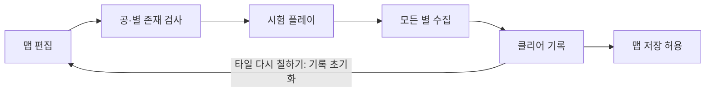

# BOUNCY BALL 사례 — 자동 바운스·맵 편집기·클리어 검증

사용자가 제공한 **BOUNCY BALL의 리메이크 (1).ent**를 2026-09-10에 정적으로 분석했다.
공을 좌우로 조종하면서 자동 반동과 특수 발판으로 별을 모으는 게임이며, 일반 맵 편집기와
맵 스토어용 편집기가 따로 있다. 장르와 기능 설명은 블록의 입력·상태 전환에서 해석했다.

원본은 수정하거나 저장소에 복사하지 않았다. 작품의 설명·주석은 분석 자료로만 취급했다.
[근거 JSON](evidence/bouncy-ball-remake.json)에 원본 해시와 정규화 JSON pointer를 기록했다.
pointer의 배열 인덱스는 0부터, 엔트리 문자열·리스트의 항목 번호는 1부터 시작한다.

- SHA-256: `065fdcdcebced1a6b44327923dabe756ae3705603a9eb107f45075016aaf44b0`
- 압축 파일 18,886,646 bytes, `temp/project.json` 2,281,845 bytes.
- 확인 범위: 압축·JSON·블록·에셋 참조, 맵 데이터 형식, 원본 수식의 숫자 교차검증.
- **편집기 실행, 실제 클리어, 맵 저장 왕복, 온라인 동기화, FPS는 검증하지 않았다.**
  아래 구현상 주의점은 실제 플레이에서 재현한 버그와 구분한다.

## 구조와 규모

| 항목 | 정적 집계 |
| --- | ---: |
| 장면 / 오브젝트 / 사용자 함수 / 신호 | 8 / 89 / 19 / 25 |
| 오브젝트 스레드 | 367 |
| 오브젝트 블록 / 함수 블록 / 합계 | 4,678 / 1,431 / 6,109 |
| 일반 변수 / 리스트 / 타이머 / 대답 | 71 / 11 / 1 / 1 |
| 오브젝트 전용 변수·리스트 선언 | 33 |
| 모양 참조 / 소리 참조 | 585 / 3 |
| TAR 이미지 / 썸네일 / 소리 파일 | 581 / 581 / 3 |

블록 수는 script/content 아래의 `type` 객체를 재귀 집계했다. 리터럴·함수 헤더·이벤트에
연결되지 않은 스택도 포함한다. 이미지 파일은 모두 PNG였고, 모양·소리의 `temp/` 참조는
모두 TAR 안에 있었다. 파일 존재가 렌더·재생 성공을 증명하지는 않는다.

| 장면 | 오브젝트 수 | 역할 |
| --- | ---: | --- |
| 첫 화면 | 8 | 진입 메뉴 |
| 게임화면 | 36 | 공·발판·별·효과 |
| 맵에디터 | 11 | 일반 단계 편집 |
| 끝 | 1 | 종료 안내 |
| 맵고르는 화면 | 5 | 선택 화면 |
| 단계 | 3 | 단계 선택 |
| 맵스토어 | 14 | 저장 맵 목록 |
| 맵 스토어의 에디터 | 11 | 제작·시험 플레이·저장 |

주요 담당은 `/objects/29` 공, `/53` 일반 편집 칸, `/87` 스토어 편집 칸,
`/22` 시간 발판, `/38` 별, `/84` 시험 플레이 버튼, `/85` 저장 버튼이다.

## 1. 한 칸을 한글 한 글자로 저장한다

**관찰.** `모든한글/70p4`는 `가`부터 `힣`까지 연속된 11,172글자다.
편집 칸의 **모양 번호**를 `char_at(모든한글, 모양 번호)`로 저장하고,
불러올 때는 `index_of_string(모든한글, 저장 글자)`로 모양 번호를 복원한다.
`각`은 2번 모양인 공의 시작 위치다. 스토어 편집기의 별 존재 검사는 3번 모양을 찾는다.

- 일반 단계는 25열 × 14행 = **350글자**의 타일 본문을 쓴다.
- 스토어·시험 플레이는 25열 × 12행 = **300글자**의 본문을 쓴다.
- 공의 일반 단계 시작 좌표는 글자 위치 `i`에 대해
  `x = -216 + ((i-1) mod 25) × 18`, `y = 118.5 - floor((i-1)/25) × 18`이다.
  스토어·시험 플레이에서는 여기에 y를 38만큼 더 내린다.
- 타일 원본 오브젝트는 종류에 따라 초기 x 보정이 다르다. 모든 타일의 실제 중심이 공과
  동일하다고 가정하지 않는다. 편집기와 플레이 화면의 시작 y도 각각의 초기값을 확인해야 한다.

**집계에서 얻은 교훈.** `단계/n8e1` 리스트는 126칸이지만, 1~111번만 맵 데이터다.
112~126번은 문자열 `"0"`이다. 앞의 111개에는 시작 글자 `각`이 각각 하나씩 있다.
따라서 “126개 스테이지 완성”으로 소개하면 안 된다. 111개 역시 완주 가능성을 확인한 수치는 아니다.

**새 작품에 적용.** 모양 번호와 저장 코드를 직접 묶으면 모양을 재정렬할 때 기존 맵의 뜻이 바뀐다.
타일 코드→모양 번호 매핑을 별도로 두고, 버전·열·행·본문 길이를 저장한다.
한글 코드는 한 칸을 한 문자로 표현하는 방법이며, UTF-8에서 한 칸이 1바이트라는 뜻은 아니다.
범위 밖 문자 접근은 [기존 문자열 타일맵 지침](04-script-and-blocks.md#문자열-타일맵--서브스텝-스윕-충돌--사이드스크롤-플랫포머)의 가드를 따른다.

## 2. 시간 발판은 타일 본문 뒤에 설정을 붙인다

**관찰.** 모양 번호 72의 발판은 초기 대기·숨김·표시 시간 세 값을 갖는다.
일반 편집 칸의 `/objects/53/script/26`은 타일 글자를 먼저 추가하고, 해당 모양일 때
`wait_second(0)` 뒤에 시간 세 글자를 추가한다. 플레이 발판은 본문 뒤에서 설정을 읽는다.

| 시간 값 | 저장할 글자의 1기반 번호 | 읽을 때 |
| --- | --- | --- |
| 초기 대기 `d` | `(d + 1) × 10` | `번호 / 10 - 1` |
| 숨김 `h` | `h × 10 + 1` | `(번호 - 1) / 10` |
| 표시 `v` | `v × 10 + 1` | `(번호 - 1) / 10` |

원본 인코더 수식에 가상 입력 `0:2,4`를 넣으면 번호 `[10, 21, 41]`이 나오며,
디코더 식으로 `[0, 2, 4]`를 복원한다. 초기 대기와 나머지 두 값의 오프셋은 서로 다르다.
실제 맵 111개 모두 `길이 = 350 + 시간 발판 수 × 3`을 만족했다.
그중 14개 맵에 시간 발판 90개가 있고, 나머지 97개는 길이 350이다.

**주의.** 디코더는 본문 끝을 현재 맵의 폭·높이가 아니라 **1번 단계의 문자열 길이**로 계산한다.
또한 이 발판의 스토어·시험 플레이 분기는 비어 있다. 일반 단계의 기능이 사용자 맵에도
동일하게 구현되어 있다고 가정하면 안 된다.

**새 작품에 적용.** 본문 길이는 `열 × 행`으로 계산하고 설정은 `칸 ID → 시간 세 값`으로 보관한다.
여러 클론이 공유 문자열에 붙이는 순서와 `0초 기다리기`에 데이터 순서를 맡기지 않는다.
칸 ID 순으로 본문을 만들고, 같은 순서로 부가 설정을 만드는 두 단계 직렬화를 권장한다.
저장된 데이터의 정합성은 확인했지만, 원본 저장기의 실행 순서 안정성은 이번에 측정하지 않았다.

## 3. 가속·감쇠와 축별 되돌리기로 자동 바운스를 만든다

**관찰.** 공이 반복 호출하는 `/functions/6`의 `묶자/qbjb`는 다음 순서다.

1. 왼쪽·오른쪽 키 또는 화면 좌·우에서의 마우스 누름에 따라 가로 속도에 ±0.15를 더한다.
2. 가로 속도에 0.909를 곱하고 x를 이동한다.
3. 가로 충돌이면 방금 이동한 x를 되돌리고 속도를 `-vx / abs(vx)`로 바꾼다.
4. 세로 속도에서 0.15를 빼고 y를 이동한다.
5. 낙하 중 일반 발판에 닿으면 y 이동을 되돌리고 세로 속도를 2.5로 설정한 뒤 다시 이동한다.
   상승 중 접촉은 되돌린 뒤 -0.5로 설정한다. 점프 발판의 반동은 4.16이다.

정지 상태에서 오른쪽 한 번 입력한 직후 속도는 `0.15 × 0.909 = 0.13635`다.
장애물·특수 동작 없이 같은 입력을 계속하는 점화식의 극한은 약 **1.49835/반복**이다.
이는 초당 속도나 측정 FPS가 아니다. 가로 충돌 식은 속력 보존 반사가 아니라 크기를 1로 바꾸는
되튕김이다. 양수 4와 음수 -4를 넣으면 각각 -1과 1이다.

대시 발판은 세로 속도를 0, 가로 속도를 ±3으로 바꾸고 별도 반복 안에서 이동한다.
획득 모양과 연타 상태를 이용한 발사 동작은 가로 ±10·세로 2 또는 세로 4를 설정한다.
단순 이동과 특수 동작은 서로 다른 경로이므로 일반 이동만 검증해서는 충분하지 않다.

**새 작품에 적용.** `vx=0`일 때 나눗셈을 따로 처리하고, 빠른 이동은
[서브스텝 충돌](04-script-and-blocks.md#문자열-타일맵--서브스텝-스윕-충돌--사이드스크롤-플랫포머)을 적용한다.
함수 `안닿을때까지 반복/lmyi`는 y를 0.1씩 옮기는 재귀이며 횟수 상한이 없다.
재사용할 때는 최대 보정 거리·반복 횟수와 실패 처리까지 정한다.
현재 작품에서 0 나눗셈·관통·재귀 오류가 실제 발생했다고 단정하지 않는다.

## 4. 맵 편집 후 직접 클리어해야 저장할 수 있다

**관찰.** 스토어 편집기의 시험 플레이 버튼은 신호를 보내 공과 별의 존재를 검사한다.
둘 중 하나가 없으면 안내 후 스레드를 중단한다. 통과하면 300칸을 `테스트/43l1`에 직렬화하고
모드를 3으로 바꿔 게임 장면으로 들어간다. 모든 별을 모으면 `클리어?/n5mx = 1`을 기록하고
스토어 편집기로 돌아간다. 저장 버튼은 이 값이 1일 때만 제목을 묻고 저장한다.



**빠진 경로.** 일반 타일을 칠할 때는 클리어 기록을 0으로 되돌리지만,
공 모양을 배치하는 `/objects/87/script/7`은 기존 공 삭제와 새 모양 적용만 수행한다.
그 분기에 클리어 기록 초기화는 없다. 따라서 “편집하면 언제나 재검증된다”는 보장은 코드에서
확인되지 않는다. 실제 UI에서 우회가 재현되는지는 별도 검사 대상이다.

**새 작품에 적용.** `클리어 여부` 하나보다 `현재 맵 버전 == 클리어한 맵 버전`으로 저장을 허용한다.
공 위치·타일·시간 설정 등 플레이에 영향을 주는 모든 편집이 버전을 올리게 한다.
공 존재뿐 아니라 **정확히 하나**, 별 최소 하나, 맵 길이·코드 범위도 검사한다.

## 5. 저장 맵 데이터와 온라인 기능의 경계를 구분한다

**관찰.** `맵스토어/lena`는 `isCloud:true`인 리스트이며 스냅샷에 452개 항목이 있다.
300글자 본문 뒤에 작성자 문자열, 쉼표, 제목을 붙이는 구조다. 452개 모두 본문 뒤에 쉼표가
존재했으며, 이 확인은 작성자·제목의 유효성이나 서버 동기화 성공 검사가 아니다.
목록은 최대 6개씩 클론으로 표시한다. 저장에서는 `get_nickname()`을 붙이고,
작성자 판별에서는 `get_user_name()`과 비교하므로 두 식별자의 계약도 확인해야 한다.

`@단계`·`@확장프로그램`과 본문이 빈 `@저장하기` 함수도 있다. 이는 외부 연동을 조사할 단서이며,
`.ent`만으로 영구 저장이 완성됐다는 증거가 아니다. 외부 저장 구현을 붙일 때는
[외부 연동 계약 구분](08-entry-online.md)을 참고하되, 이 작품이 그 계약을 사용한다고 단정하지 않는다.
원본에 담긴 이용자 식별자·채팅·사용자 맵 본문·이미지·음원은 근거 파일에 복사하지 않았다.

## 분석·재사용 시 확인할 것

- `/objects/44/script/5`의 오래된 물리 스택과 `/objects/53/script/5`의 도장 반복은
  이벤트에 연결되지 않았다. 보이는 블록을 모두 현재 실행 코드로 집계하면 설계를 잘못 해석한다.
- 편집 칸 생성은 위치와 오브젝트 전용 번호를 바꾸며 클론을 만든다. 신호 저장에서는 원본의 번호 0을
  제외한다. 새 구현도 원본과 클론의 처리 대상을 명확히 나누고, 직렬화 순서는 명시적으로 정한다.
- 최소 재사용 검증: 빈 맵·중복 공 거부, 마지막 열→다음 행 좌표, 시간 설정 0·소수 값 왕복,
  저장 후 같은 칸 복원, 클리어 후 공 이동 시 재검증, 고속 대시의 얇은 발판 통과 여부.

## 근거 재검증

원본을 가진 환경에서 실제 파일 위치로 바꾸어 실행한다.

```powershell
node tools/verify-case-study-evidence.mjs --source "C:/작품/BOUNCY BALL의 리메이크 (1).ent" --evidence knowledge/evidence/bouncy-ball-remake.json
```

검증기는 원본 해시와 961개 선언·블록·값 주장을 재검사한다. 근거 파일의 집계·맵 형식·수식 교차검증
요약은 분석 시 별도로 계산했으며 이 명령이 다시 계산하지 않는다. 실행 순서·플레이 감각·온라인 기능을
확인한 결과로 해석하지 않는다.
